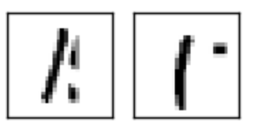
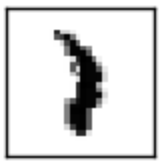

## False Positives

This case shows examples of benign images that violate the VIs and cause false
positives. As we can see, there are unexpected black regions beside the main
body of the digits, and they will lead to the violation of VIs.

This case shows an example of benign image violating the PIs, which is a false
positive. We find that the neuron network cannot tell if this is a 1 or 7, and
the probabilty of the two keeps changing. This is an unusually behavior in the
layers near the output layer. Thus it violates the PI and is detected as an
adversarial example, which is wrong.
